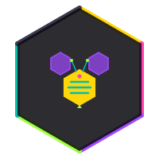
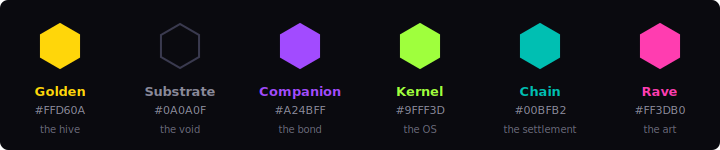

<div align="center">



# bnri-cosmic

**Native COSMIC desktop client for the Beehive Nature Reserve.**

BNRi hex-pixel inscriptions · bLOVErAi companion · wallet · node status.<br>
Rust, no Electron. Same language as the kernel.

[Kernel](#what-this-is) · [The Palette](#the-palette--colors-group-the-energy) · [The Weave](#the-weave--credits) · [License](#license)

</div>

## What this is

**BNRi is the front door. The kernel is the product.**

This repo is the local GUI for people running the [Beehive Nature Reserve kernel](https://github.com/beehive-nature/beehive-nature) — a sovereign AI operating system in Rust. Six views: inscription gallery, bLOVErAi chat, wallet, node status, farming cycle tracker, inscription detail.

The public inscription explorer (Blockscout fork, chain-agnostic) is separate — a web hook that works before install. Two GUIs, two audiences: COSMIC is the local product for kernel operators; the web explorer is the front door that opens without a download. This repo is the first one.

## The palette — colors group the energy

BNRi's six theme colors are not decoration. Each one names a force in the system, and the hex-pixel art renders them at full saturation on a near-black substrate.

<div align="center">

</div>

| Hex | Name | Intention |
|---|---|---|
| `#FFD60A` | **Golden** | **The hive.** The collective, the earned energy. b-token, metabolic, SPIRIT-1 — never granted, never gas. The color of work that compounds. |
| `#0A0A0F` | **Substrate** | **The void.** Bitcoin's data layer. The background of the hex grid — everything renders on this, nothing escapes it. exSat docks here. |
| `#A24BFF` | **Companion** | **The bond.** bLOVErAi — the private 1:1 AI companion, eternally bonded to one human, running locally, never leaving the machine. |
| `#9FFF3D` | **Kernel** | **The OS.** The sovereign runtime. The Beehive Nature Reserve kernel — 16 crates, Rust, the thing this app is a client of. Growth, green, alive. |
| `#00BFB2` | **Chain** | **The settlement.** exSat EVM — Bitcoin-docked, Antelope consensus. The bridge between the art and the data layer. Teal = the water the hive drinks. |
| `#FF3DB0` | **Rave** | **The art.** The front door. BNRi itself — the hook that brings people in. Joy, saturation, the 90s cypherpunk-raver energy. The color of the front door. |

The logo's hex frame carries all six — each edge a different intention, closing the loop back to the hive.

## Build

Targets **COSMIC on Linux**. Windows was never the target.

### Headless (lib + tests — any host)

```sh
cargo check --lib
cargo test --lib --tests
cargo clippy --lib --tests --no-deps
```

No GUI system libs required. The lib target compiles and tests cleanly on any Linux host, in CI, and on the b-indexer path.

### GUI (the binary — needs COSMIC system libs)

```sh
# Install build deps (Pop!_OS / Ubuntu):
sudo apt install libxkbcommon-dev libwayland-dev libinput-dev libdbus-1-dev \
                 libfontconfig-dev libudev-dev libseat-dev libsystemd-dev

cargo run --features gui          # or --features wgpu for the wgpu backend
```

### Why `gui` is a feature

`libcosmic` is `optional = true`, gated behind `gui`. The lib target doesn't use it — only `main.rs` does. Without this gating, `cargo check --lib` pulls libcosmic and fails on `smithay-client-toolkit` needing `xkbcommon`. The lib must be headless-testable; a GUI toolkit as a hard dep of the lib defeats the `[lib]`/`[[bin]]` split.

```toml
[features]
default = []
evm = ["dep:ethers"]    # wallet.rs — behind evm because ethers 2.0.14 carries advisories
gui = ["libcosmic"]
wgpu = ["gui", "libcosmic/wgpu"]
```

`evm` is default-off too: ethers 2.0.14 pins `ring 0.16.20` and `rustls-webpki 0.101.7` (4 advisories). wallet.rs is stubs (8 TODOs, four never-read fields). Vulnerable code that does nothing, imported by a stub that isn't wired. The ethers-vs-alloy question belongs to C-3, where real signing will supply the evidence to settle it. See `AUDIT.md` for the standing order.

## The stub warnings

`cargo check --lib` reports **one** warning. `cargo check --lib --features evm` reports **four**. All of them are supposed to be there.

- `wallet.rs` — `evm_provider`, `bnri_contract`, `user_address` never read
- `wallet.rs` — `bnri_address` unused (`connect()` is a stub)
- `wallet.rs` — `action` unused (`simulate_transaction()` is a stub)
- `agent.rs` — `Bloverai::context_path` never read (encrypted Autonomi context store not wired)

That warning list **is** the C-3 dispatch: tiered signing, transaction simulation, the quote path, bLOVErAi's context store. **Do not silence them.** No `#[allow(dead_code)]`, no `_` rename. An unfinished stub should look unfinished to the toolchain. When C-3 implements the fields, these go to zero on their own.

Note: with `ethers` behind `evm` (default-off), the `wallet.rs` warnings appear only under `--features evm` — the surface C-3 works on. The marker moved *to* the dispatch, not away from it.

## Test design

The `sidecar_ipc` tests use Python fake sidecars (echo, echo-then-silent, silent). The kill test applies the **liveness-before-death** ruling: one successful round-trip `infer()` *before* calling `stop()`. If `python3` is broken or missing, the test fails loudly at the liveness probe instead of passing vacuously at the kill assertion. `test_timeout_fires` is the canary: green ⇒ the silent sidecar is genuinely alive and silent ⇒ the kill test's `NotRunning` is real, not vacuous.

## Status

Honest, not aspirational. This repo is public because AGPL-3.0 wants the open, and because a repo whose history shows the review catching real defects is more credible than one that sprang out fully formed.

- **25/0 tests** on the Linux draft host (lib 6 + hex_fixtures 5 + hexrect_codec 10 + sidecar_ipc 4). **Not reproduced on a host we currently hold** — the sidecar tests need a working `python3`.
- **Clippy clean** except for the named stub warnings (one in default, four under `--features evm`).
- **`is_running()` reads an `AtomicBool`** cleared by both `stop()` and the reader task on EOF — truthful after a child dies on its own. The k001-class fix (`writer.is_some()` reported *our handle*, not the child) landed at `d33f0cb`.
- **No `Signed-off-by:` on early commits.** DCO ruling landed mid-push; the machine-seat policy is in CONTRIBUTING.md. It enters force when ORDERS-1 v0.8 is ratified by founder commit.

## The Weave — credits

Nothing here is built from nothing. This is a weave, and the threads belong to the people who spun them.

### The substrate

- **Satoshi Nakamoto** — Bitcoin. The data layer BNRi settles on. Everything below is downstream.
- **Dan Larimer** — Antelope/eosio consensus lineage. exSat runs spring/Savanna; the consensus family exSat carries BNRi on.
- **The exSat team** — the Bitcoin-docked EVM chain. ChainId 7200, BTC gas at 0.0005 gwei, Shanghai confirmed.

### The inscription standard

- **The ERC-20i authors** — the inscription standard that made on-chain art a first-class primitive.
- **The Pepi team** (Base) — the surviving reference implementation. BNRi's Solidity forks Pepi v2.
- **The Fungi team** (`ToddStool`) — the 24×24 predecessor. The `svg-to-solidity` tool came from here.

### The GUI

- **Michael Murphy / System76** — COSMIC desktop, libcosmic. The Rust GUI toolkit this app is built on.
- **The iced team** — the underlying framework libcosmic builds on.

### The kernel & runtime

- **The Rust team** — the language. Same language as the kernel, same language as the GUI. No Electron.
- **The Tokio team** — the async runtime the sidecar IPC and all network code runs on.
- **The Beehive Nature Reserve** — the kernel this app is a client of. 16 crates, 324/0/1 tests, AGPL-3.0-only.

### The AI

- **GLM / ZhipuAI / z.ai** — GLM-5.2, the local LLM that powers bLOVErAi. Runs on-machine, never leaves the machine.

### The security

- **The GrapheneOS team** — `hardened_malloc`, the memory allocator. The mobile target is GrapheneOS/Android.
- **Trezor** — hardware wallet that holds root keys. Large transactions require a button press. (Model to be confirmed — Safe 3 and Safe 5 are the known lineup; verify before crediting a specific model.)

### The storage

- **The Autonomi team** — eternal storage. The kernel binary, model weights, and bLOVErAi's encrypted context live here. Pay once, never deleted.

### The DEX

- **The Uniswap team** — V3, the DEX architecture BNRi forks. First V3 on exSat. 420-year eternal LP lock.

### The crew — the hive

- **Fable** (Seat 1) — the reviewer, and the most-corrected seat. Six of its errors were caught downstream this week — every one by someone running the thing instead of trusting the rule.
- **Claude Code** (Seat 3) — the compiler gate. Pasted the cargo output, refused to fabricate, caught the shallow clone.
- **zResident** (Seat 2) — the app gate. Drafted under spec on a Linux host. The R2 drafts assembled here are verbatim from that work.
- **King Bee** (Seat 0) — the founder. The rulings, the go, the machine. "BNRi is the front door, the kernel is the product."

> The art is signed. The balance is the seed so velocity is the brush. Three eternals on a commit-reveal draw.
>
> *420 years is the marketing; forever is the math.*
>
> **— The ArTisT LoVis waTeR**

## License

- **Code:** AGPL-3.0-only ([LICENSE](./LICENSE)). Copyleft at the client, by design.
- **Sprite pixel data:** licence not yet determined. (CC0 is under consideration — on-chain art is copyable by physics, and the value is provenance, not pixels — but a public licence grant on the art is the artist's to make and is irreversible. Default to the reversible direction until ruled.)

## Contributing

See [CONTRIBUTING.md](./CONTRIBUTING.md). DCO sign-off required (`git commit -s`). Machine-seat policy documented there — a model cannot make the DCO's certification.

---

<div align="center">
<sub>Built to a set of our own making.</sub><br>
<sub>The hive is public. The front door is open.</sub>
</div>
